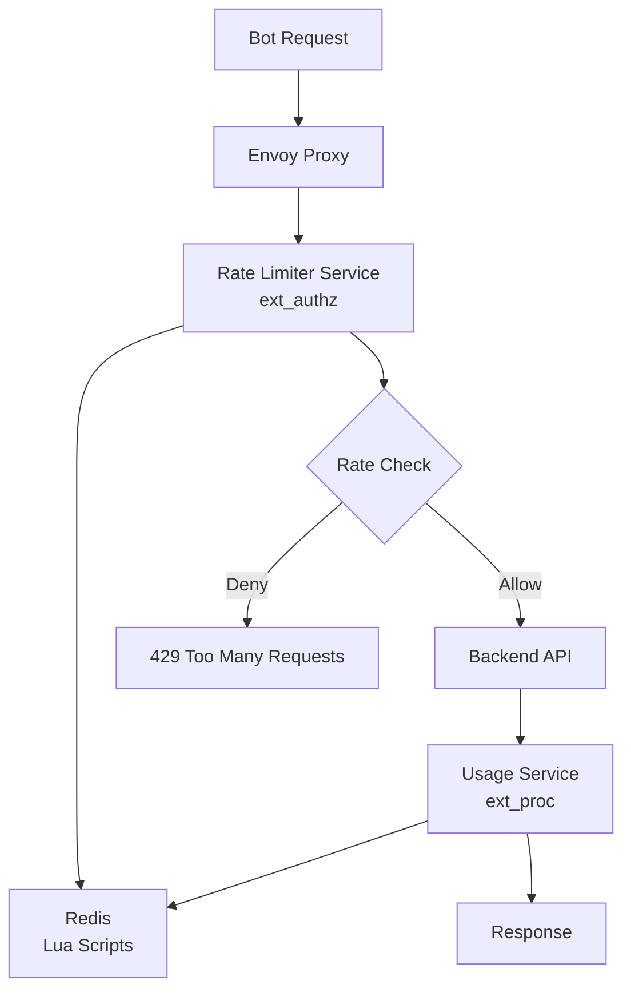

# Bot Rate Limiting System

A comprehensive rate limiting solution for bot APIs using Envoy Proxy, Redis, and Go services. This system implements the SaaS subscription rate limiting design with dual-level rate limiting: per-second rate limits and subscription-based quotas.

## Architecture Overview



## Key Features

### 🔒 **Dual-Level Rate Limiting**
- **Rate Limiting**: Requests per second (burst protection)
- **Quota Limiting**: Total requests per billing period

### 🚀 **High Performance**
- Redis Lua scripts for atomic operations
- Fixed window rate limiting algorithm
- Automatic key expiration (1 second for rate counters)

### 🎯 **Bot Token Extraction**
- Parses bot tokens from URL paths: `/bot{TOKEN}/endpoint`
- Example: `/bot6148450508:AAFl4_SrGS-wh4wiO70XFb3dY_74ikigA1M/getUpdates`

### 📊 **Usage Tracking**
- Pre-increments usage counters for quota checks during authorization
- Tracks response status codes and reduces usage for failed requests
- Supports configurable paid status codes (200, 201, 202, 204, 206, 304)
- Failed requests get usage refunded automatically

## Redis Key Patterns

The system uses a simplified Redis key structure based on the design document:

```redis
# Rate Limits (per bot)
rate_limit:{bot_id} → 50 (requests per second)

# Rate Counters (per second window)
counter:{bot_id}:{timestamp} → 23 (requests in current second)
TTL: 1 second (auto-cleanup)

# Usage Totals (current billing period)
usage:{bot_id} → 1247 (total requests this period)

# Quota Limits (per bot)
quota:{bot_id} → 5000 (monthly quota limit)
```

### Example for Bot `6148450508`:
```redis
rate_limit:6148450508 → 50
counter:6148450508:1718409600 → 23
usage:6148450508 → 1247
quota:6148450508 → 5000
```

## Quick Start

### 1. **Start the Backend Services**
```bash
# Start Redis, rate limiter, usage service, and backend API
docker-compose up -d

# Check service health
docker-compose ps
```

### 2. **Start Envoy Proxy (Separate Service)**
```bash
# Option 1: Run Envoy with Docker (recommended)
docker run --rm -it -p 10000:10000 -p 9901:9901 \
  -v $(pwd)/envoy-docker.yaml:/etc/envoy/envoy.yaml \
  --network host \
  envoyproxy/envoy:v1.28-latest \
  envoy -c /etc/envoy/envoy.yaml --service-cluster front-proxy

# Option 2: Run Envoy binary directly (if installed)
envoy -c envoy-docker.yaml --service-cluster front-proxy
```

### 3. **Configure Bot Limits**
```bash
# Set rate limit and quota for bot 6148450508
uv run scripts/setup_bot_limits.py --bot 6148450508 --rate 50 --quota 5000 --action set

# Check bot status
uv run scripts/setup_bot_limits.py --bot 6148450508 --action get
```

### 4. **Make API Requests**
```bash
# Valid request (should work)
curl "http://localhost:10000/bot6148450508:AAFl4_SrGS-wh4wiO70XFb3dY_74ikigA1M/getUpdates"

# Check rate limit headers
curl -I "http://localhost:10000/bot6148450508:AAFl4_SrGS-wh4wiO70XFb3dY_74ikigA1M/getMe"
```

## Service Components

### 🛡️ **Rate Limiter Service** (Port 9001)
- **Purpose**: Envoy ext_authz integration
- **Function**: Pre-request authorization and rate limiting
- **Technology**: Go gRPC service with Envoy Authorization API
- **Key Features**:
  - Bot token extraction from URL path (`/bot{TOKEN}/endpoint`)
  - Atomic rate and quota checks via Redis Lua scripts
  - Pre-increments both rate and usage counters
  - Returns detailed limit information in response headers
  - Supports regex-based bot token validation

### 📈 **Usage Tracking Service** (Port 9002)
- **Purpose**: Envoy ext_proc integration  
- **Function**: Post-request usage adjustment based on response status
- **Technology**: Go gRPC service with Envoy External Processing API
- **Key Features**:
  - Processes both request and response headers
  - Tracks bot tokens per request ID for correlation
  - Reduces usage for failed requests (non-paid status codes)
  - Maintains quota headers in responses
  - Configurable paid status codes: 200, 201, 202, 204, 206, 304

### 🚪 **Envoy Proxy** (Port 10000) - Separate Service
- **Purpose**: Request routing and filtering
- **Configuration**: `envoy-docker.yaml`
- **Deployment**: Runs separately from Docker Compose services
- **Filters**:
  - `ext_authz`: Rate limit checking (Rate Limiter Service)
  - `ext_proc`: Usage tracking (Usage Service)
  - `router`: Request forwarding to backend

### 🗄️ **Redis** (Port 6379)
- **Purpose**: Rate limit storage and Lua script execution
- **Key Features**:
  - Atomic operations with Lua scripts
  - Automatic key expiration
  - High-performance counters

### 🔧 **Backend API** (Port 8000)
- **Purpose**: Bot API simulation
- **Technology**: FastAPI
- **Endpoints**:
  - `POST /sendMessage`: Test endpoint with configurable responses

## API Endpoints

### Bot API Format
```
http://localhost:10000/bot{BOT_TOKEN}/{ENDPOINT}
```

### Examples
```bash
# Get bot updates
GET /bot6148450508:AAFl4_SrGS-wh4wiO70XFb3dY_74ikigA1M/getUpdates

# Get bot info  
GET /bot6148450508:AAFl4_SrGS-wh4wiO70XFb3dY_74ikigA1M/getMe

# Send message (POST)
POST /bot6148450508:AAFl4_SrGS-wh4wiO70XFb3dY_74ikigA1M/sendMessage
Content-Type: application/json
{
  "message": "Hello World",
  "status": 200
}
```

## Rate Limiting Responses

### ✅ **Successful Request** (200)
```json
{
  "message": "Message received: Hello World",
  "status": 200,
  "success": true
}
```

**Headers:**
- `x-bot-token`: Bot token that was processed
- `x-quota-remaining`: Remaining quota for billing period  
- `x-quota-limit`: Total quota limit
- `x-rate-limit`: Rate limit per second

### 🚫 **Rate Limited** (429)
```json
{
  "error": "rate_exceeded", 
  "message": "Rate limit exceeded - too many requests per second"
}
```

**Headers:**
- `retry-after`: 1 (seconds to wait)
- `x-rate-limit-reason`: Specific reason for limit

### 🚫 **Quota Exceeded** (429)
```json
{
  "error": "quota_exceeded",
  "message": "Bot quota exceeded (5000/5000 requests used)"
}
```

**Headers:**
- `retry-after`: 3600 (seconds until next billing period)

### ❌ **Invalid Bot Token** (401)
```json
{
  "error": "invalid_bot_token",
  "message": "Invalid or missing bot token in URL"
}
```

## Configuration

### Environment Variables

#### Rate Limiter Service
```bash
REDIS_ADDR=localhost:6379    # Redis connection string
GRPC_PORT=:9001             # gRPC server port
```

#### Usage Service
```bash
REDIS_ADDR=localhost:6379    # Redis connection string  
GRPC_PORT=:9002             # gRPC server port
```

### Default Rate Limits
- **Rate Limit**: 50 requests/second (configurable per bot)
- **Quota Limit**: 5,000 requests/month (configurable per bot)
- **Paid Status Codes**: 200, 201, 202, 204, 206, 304 (requests that count toward usage)
- **Management**: Redis-based configuration via scripts

## Management Tools

### Bot Limit Management
```bash
# Set bot rate and quota limits (defaults: 50 req/sec, 5000 quota)
uv run scripts/setup_bot_limits.py --bot 6148450508 --rate 100 --quota 10000 --action set

# Get bot status and current usage
uv run scripts/setup_bot_limits.py --bot 6148450508 --action get

# Delete all bot data (limits, usage, counters)
uv run scripts/setup_bot_limits.py --bot 6148450508 --action delete

# Connect to custom Redis instance
uv run scripts/setup_bot_limits.py --redis localhost:6379 --bot 6148450508 --action get
```

### Testing Tools
```bash
# Test basic functionality with curl
curl "http://localhost:10000/bot6148450508:AAFl4_SrGS-wh4wiO70XFb3dY_74ikigA1M/getUpdates"

# Test rate limiting by making multiple requests quickly
for i in {1..10}; do curl -s "http://localhost:10000/bot6148450508:AAFl4_SrGS-wh4wiO70XFb3dY_74ikigA1M/getMe"; done

# Check rate limit headers
curl -I "http://localhost:10000/bot6148450508:AAFl4_SrGS-wh4wiO70XFb3dY_74ikigA1M/getMe"
```

## Monitoring

### Health Checks
```bash
# Check all services
docker-compose ps

# Check Redis connectivity
docker-compose exec redis redis-cli ping

# Check Envoy admin interface
curl http://localhost:9901/stats
```

### Redis Monitoring
```bash
# Check current keys for a specific bot
docker-compose exec redis redis-cli KEYS "*6148450508*"

# Monitor real-time commands
docker-compose exec redis redis-cli MONITOR

# Check memory usage
docker-compose exec redis redis-cli INFO memory

# Check specific bot data
docker-compose exec redis redis-cli GET rate_limit:6148450508
docker-compose exec redis redis-cli GET quota:6148450508
docker-compose exec redis redis-cli GET usage:6148450508
```

### Logs
```bash
# View all logs
docker-compose logs -f

# Service-specific logs
docker-compose logs -f rate_limiter
docker-compose logs -f usage_service
docker-compose logs -f envoy
```

## Technical Implementation

### Rate Limiter Service Details

The rate limiter implements Envoy's External Authorization API:

```go
// Bot token extraction from URL path
var botTokenRegex = regexp.MustCompile(`^/bot([0-9]+:[A-Za-z0-9_-]+)/`)

// Redis key generation for bot ID
func generateKeys(botToken string, currentTime int64) *RedisKeys {
    botID := strings.Split(botToken, ":")[0]
    return &RedisKeys{
        RateLimit:  fmt.Sprintf("rate_limit:%s", botID),
        Counter:    fmt.Sprintf("counter:%s:%d", botID, currentTime),
        UsageTotal: fmt.Sprintf("usage:%s", botID),
        QuotaLimit: fmt.Sprintf("quota:%s", botID),
    }
}
```

### Usage Tracking Service Details

The usage service implements Envoy's External Processing API:

```go
// Configurable paid status codes
paidStatusCodes := map[int]bool{
    200: true, // OK
    201: true, // Created
    202: true, // Accepted
    204: true, // No Content
    206: true, // Partial Content
    304: true, // Not Modified (cached response)
}
```

### Lua Script Implementation

The rate limiting logic is implemented in Redis Lua for atomicity:

```lua
-- Check rate and quota limits atomically
-- Pre-increment counters for authorization
-- Return: {allowed, reason, quota_used, quota_limit, rate_used}
```

### Service Communication Flow

1. **Request Phase**: Rate Limiter → Redis (check + increment)
2. **Response Phase**: Usage Service → Redis (adjust based on status)
3. **Header Correlation**: Request ID links rate limiter and usage tracking

### Dependencies

**Rate Limiter Service (Go 1.21):**
- `github.com/envoyproxy/go-control-plane v0.12.0` - Envoy gRPC APIs
- `github.com/go-redis/redis/v8 v8.11.5` - Redis client with Lua script support
- `google.golang.org/grpc v1.60.1` - gRPC server implementation

**Usage Service (Go 1.21):**
- Same dependencies as Rate Limiter
- Implements ext_proc (External Processing) API
- Uses request/response correlation for usage tracking

## Development

### Building Services
```bash
# Build rate limiter
cd rate_limiter
go mod tidy
go build -o rate_limiter .

# Build usage service
cd usage_service  
go mod tidy
go build -o usage_service .

# Build with Docker
docker-compose build rate_limiter usage_service
```

### Running Locally
```bash
# Start Redis
docker run -d -p 6379:6379 redis:7-alpine

# Start rate limiter
cd rate_limiter
REDIS_ADDR=localhost:6379 go run .

# Start usage service
cd usage_service
REDIS_ADDR=localhost:6379 go run .

# Start backend
uvicorn main:app --port 8000

# Start Envoy (separate terminal)
envoy -c envoy-docker.yaml --service-cluster front-proxy
```

## Troubleshooting

### Common Issues

#### 1. **Services Not Starting**
```bash
# Check Docker Compose logs
docker-compose logs

# Restart services
docker-compose down && docker-compose up -d
```

#### 2. **Redis Connection Failed**
```bash
# Check Redis health
docker-compose exec redis redis-cli ping

# Verify Redis port
docker-compose ps redis
```

#### 3. **Rate Limits Not Working**
```bash
# Check if bot limits are set
docker-compose exec redis redis-cli GET "rate_limit:6148450508"
docker-compose exec redis redis-cli GET "quota:6148450508"

# Set default limits manually
docker-compose exec redis redis-cli SET "rate_limit:6148450508" 50
docker-compose exec redis redis-cli SET "quota:6148450508" 5000

# Check current usage
docker-compose exec redis redis-cli GET "usage:6148450508"
```

#### 4. **Invalid Bot Token Error**
- Verify URL format: `/bot{TOKEN}/endpoint`
- Check token format: `{BOT_ID}:{SECRET}`
- Example: `/bot6148450508:AAFl4_SrGS-wh4wiO70XFb3dY_74ikigA1M/getUpdates`

### Debug Mode
```bash
# Enable verbose logging
export LOG_LEVEL=debug

# Check Envoy configuration
curl http://localhost:9901/config_dump
```

## Performance Tuning

### Redis Optimization
```bash
# Increase Redis memory limit
docker-compose exec redis redis-cli CONFIG SET maxmemory 256mb

# Check Redis performance
docker-compose exec redis redis-cli --latency-history
```

### Rate Limiter Tuning
- Adjust rate limits based on subscription tiers
- Monitor Redis memory usage for high-traffic bots
- Consider sharding for very high-volume deployments

## License

This project is licensed under the MIT License. See [LICENSE](LICENSE) file for details.

## Contributing

1. Fork the repository
2. Create a feature branch
3. Make your changes
4. Add tests for new functionality
5. Submit a pull request

---

For more information, see the [SaaS Rate Limiting Design Document](saas_rate_limiting_design.md) and [Rate Limiting Knowledge Base](rate_limiting_knowledge_base.md).
